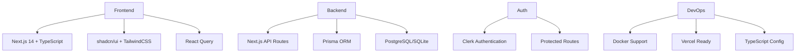

<div align="center">

# 🚀 Next.js Fullstack Starter

[](https://nextjs.org/)
[](https://www.typescriptlang.org/)
[](https://www.postgresql.org/)
[](https://www.prisma.io/)
[](https://clerk.com/)
[](https://tailwindcss.com/)
[](LICENSE)

**Production-ready Next.js 14 fullstack template with modern tools and best practices**

[🚀 Quick Start](#quick-start) •
[📖 Documentation](./docs) •
[🎯 Features](#features) •
[🏗️ Architecture](./docs/architecture) •
[🤝 Contributing](#contributing)

</div>

---

## ✨ Features

<table>
<tr>
<td>

**🎯 Core Framework**
- ⚡ Next.js 14 with App Router
- 🔷 TypeScript for type safety
- 🎨 TailwindCSS for styling
- 📱 Responsive design

</td>
<td>

**🔐 Authentication**
- 🛡️ Clerk Auth (v5.6.0)
- 👥 User management
- 🔒 Protected routes
- 📧 Email verification

</td>
</tr>
<tr>
<td>

**💾 Database**
- 🐘 PostgreSQL primary
- 🗃️ SQLite development option
- ⚡ Prisma ORM
- 🔄 Migration system

</td>
<td>

**🎨 UI Components**
- 🧩 shadcn/ui components
- 🌓 Dark/Light theme
- ♿ Accessibility ready
- 📊 Data tables

</td>
</tr>
<tr>
<td>

**📁 File Upload**
- 📤 UploadThing integration
- 🖼️ Image upload components
- 📄 Document handling
- 🎥 Video support

</td>
<td>

**⚡ Advanced Features**
- 🔄 React Query caching
- 🛠️ Server Actions
- 📝 Form validation
- 🎯 Type-safe APIs

</td>
</tr>
</table>

---

## 🚀 Quick Start

> **Prerequisites**: Node.js 18+, npm/yarn/pnpm

### 1️⃣ **Clone & Install**

```bash
git clone https://github.com/khanakat/nextjs-fullstack-starter.git
cd nextjs-fullstack-starter
npm install
```

### 2️⃣ **Environment Setup**

```bash
cp .env.example .env.local
```

Configure your `.env.local` with:
- Clerk authentication keys
- Database URL
- Other environment variables

### 3️⃣ **Database Setup**

**Option A: Quick PostgreSQL (Docker)**
```bash
npm run db:postgres:docker
```

**Option B: Local PostgreSQL**
```bash
npm run db:postgres:local
```

**Option C: Development SQLite**
```bash
npm run db:sqlite
```

### 4️⃣ **Launch Development**

```bash
npm run dev
```

🎉 Visit [http://localhost:3000](http://localhost:3000)

---

## 📖 Documentation

| Guide | Description |
|-------|-------------|
| [📚 Getting Started](./docs/getting-started) | Installation, setup, and first steps |
| [🔐 Authentication](./docs/guides/authentication.md) | Clerk setup and user management |
| [💾 Database](./docs/guides/database.md) | PostgreSQL, Prisma, and migrations |
| [🚀 Deployment](./docs/guides/deployment.md) | Vercel, Docker, and production tips |
| [🏗️ Architecture](./docs/architecture) | Project structure and patterns |
| [🎯 Examples](./docs/examples) | Code samples and tutorials |

---

## 🛠️ Available Scripts

```bash
# Development
npm run dev          # Start dev server
npm run build        # Build for production
npm run start        # Start production server

# Database Management
npm run db:setup     # Interactive database setup
npm run db:migrate   # Run migrations
npm run db:seed      # Seed with sample data
npm run db:studio    # Open Prisma Studio
npm run db:reset     # Reset database

# Database Specific
npm run db:postgres:docker  # Setup PostgreSQL with Docker
npm run db:postgres:local   # Setup local PostgreSQL
npm run db:sqlite          # Switch to SQLite

# Utilities
npm run type-check   # TypeScript checks
npm run lint         # ESLint checks
```

---

## 🎯 Use Cases

<details>
<summary><b>🏢 SaaS Applications</b></summary>

Perfect for building SaaS products with:
- User authentication and management
- Subscription billing integration
- Multi-tenant architecture
- Admin dashboards
</details>

<details>
<summary><b>📱 Social Platforms</b></summary>

Ideal foundation for:
- User profiles and social features
- Content management systems
- Real-time notifications
- Media upload handling
</details>

<details>
<summary><b>🛒 E-commerce Sites</b></summary>

Ready for online stores with:
- Product catalog management
- User accounts and orders
- Payment processing integration
- Inventory management
</details>

---

## 🏗️ Tech Stack



---

## 🤝 Contributing

We welcome contributions! Please see our [Contributing Guide](CONTRIBUTING.md) for details.

### 🐛 Found a bug?
[Create an issue](https://github.com/khanakat/nextjs-fullstack-starter/issues)

### 💡 Have a feature request?
[Start a discussion](https://github.com/khanakat/nextjs-fullstack-starter/discussions)

---

## 📄 License

MIT License - see the [LICENSE](LICENSE) file for details.

---

<div align="center">

**⭐ If this project helped you, please give it a star!**

[🐙 GitHub](https://github.com/khanakat/nextjs-fullstack-starter) •
[📝 Issues](https://github.com/khanakat/nextjs-fullstack-starter/issues) •
[💬 Discussions](https://github.com/khanakat/nextjs-fullstack-starter/discussions)

Made with ❤️ by [khanakat](https://github.com/khanakat)

</div>