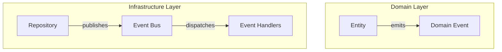
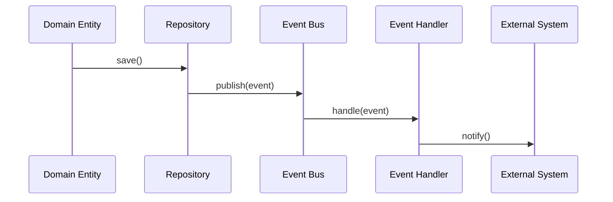

# ADR-003: Event Bus Implementation

**Status:** Proposed
**Date:** 2026-01-11
**Context:** Architecture Review

## Context

The project has domain events properly defined and emitted from entities, but there's no mechanism to:
1. Publish domain events to external systems
2. Handle events across slices
3. Enable event-driven architecture
4. Implement eventual consistency

Current state:
- ✅ Domain events are created in entities
- ✅ Domain events are stored in aggregate roots
- ❌ Events are not published to an event bus
- ❌ No event handlers exist
- ❌ No cross-slice communication via events

## Decision

**Implement an Event Bus** with the following characteristics:

1. **In-process event bus** for synchronous event handling
2. **Async event bus** for eventual consistency
3. **Event handlers** for reacting to domain events
4. **Event publishing** from repositories

### Architecture



### Event Bus Interface

```typescript
interface IEventBus {
  publish<T extends DomainEvent>(event: T): Promise<void>;
  subscribe<T extends DomainEvent>(
    eventType: string,
    handler: (event: T) => Promise<void>
  ): UnsubscribeFunction;
}
```

### Event Handler Interface

```typescript
interface IEventHandler<T extends DomainEvent> {
  handle(event: T): Promise<void>;
}
```

## Implementation Plan

### Phase 1: Core Event Bus

1. Create `IEventBus` interface in `src/shared/infrastructure/events/`
2. Implement `InMemoryEventBus` for synchronous events
3. Implement `AsyncEventBus` for async events (using message queue)
4. Create `EventHandlerRegistry` for managing handlers

### Phase 2: Repository Integration

1. Update repository base class to publish events after save
2. Add event publishing to all Prisma repositories
3. Ensure events are published within transaction boundaries

### Phase 3: Event Handlers

1. Create event handlers for cross-slice communication
2. Implement handlers for:
   - UserCreated → Create default organization
   - ReportPublished → Send notifications
   - NotificationCreated → Update counters
3. Register handlers in DI container

### Phase 4: External Integration

1. Implement message queue integration (BullMQ)
2. Add event publishing to external systems
3. Implement event replay for recovery

## Event Handling Flow



## Benefits

1. **Loose coupling** - Slices communicate via events
2. **Eventual consistency** - Async event handling
3. **Audit trail** - All changes are logged as events
4. **Extensibility** - New handlers can be added without modifying existing code
5. **Testing** - Event handlers can be tested in isolation

## Considerations

### Transaction Boundaries

Events should be published **after** transactions commit to ensure:
- Events represent committed state
- No partial state is published
- Handlers see consistent state

### Event Ordering

Event handlers should:
- Be idempotent (handle same event multiple times safely)
- Handle events in order
- Not block event publishing

### Error Handling

Event handler failures should:
- Not prevent event publishing
- Be logged for monitoring
- Have retry mechanisms for critical handlers

## Example Implementation

### Event Bus

```typescript
// src/shared/infrastructure/events/in-memory-event-bus.ts
export class InMemoryEventBus implements IEventBus {
  private handlers = new Map<string, Set<Function>>();

  async publish<T extends DomainEvent>(event: T): Promise<void> {
    const handlers = this.handlers.get(event.getEventName());
    if (handlers) {
      await Promise.all([...handlers].map(h => h(event)));
    }
  }

  subscribe<T extends DomainEvent>(
    eventType: string,
    handler: (event: T) => Promise<void>
  ): () => void {
    if (!this.handlers.has(eventType)) {
      this.handlers.set(eventType, new Set());
    }
    this.handlers.get(eventType)!.add(handler);
    return () => this.handlers.get(eventType)!.delete(handler);
  }
}
```

### Repository Integration

```typescript
// src/shared/infrastructure/database/base-repository.ts
export abstract class BaseRepository<T extends AggregateRoot<any>> {
  async save(entity: T): Promise<void> {
    await this.prisma.save(entity);
    // Publish domain events
    for (const event of entity.domainEvents) {
      await this.eventBus.publish(event);
    }
    entity.markEventsAsCommitted();
  }
}
```

### Event Handler

```typescript
// src/slices/notifications/infrastructure/handlers/report-published-handler.ts
export class ReportPublishedHandler implements IEventHandler<ReportPublishedEvent> {
  constructor(
    private notificationService: INotificationService
  ) {}

  async handle(event: ReportPublishedEvent): Promise<void> {
    await this.notificationService.send({
      userId: event.publishedBy,
      title: `Report "${event.title}" published`,
      message: 'Your report is now available'
    });
  }
}
```

## Migration Strategy

1. **Phase 1** - Implement core event bus (Week 1)
2. **Phase 2** - Integrate with repositories (Week 2)
3. **Phase 3** - Create event handlers (Week 3-4)
4. **Phase 4** - External integration (Week 5+)

## References

- [Architecture Review Report](../architecture-review.md)
- [ADR-001: DI Container Standardization](./adr-001-di-container-standardization.md)
- [Domain-Driven Design - Domain Events](https://domainlanguage.com/ddd/reference/)
- [Event-Driven Architecture](https://martinfowler.com/eaaDev/EventDrivenArchitecture.html)
