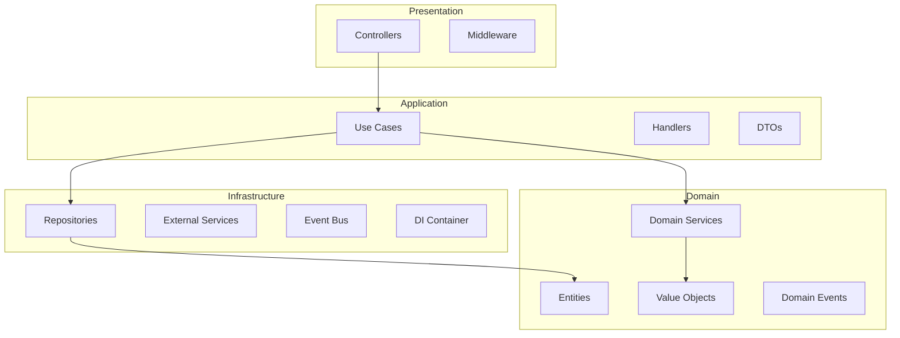
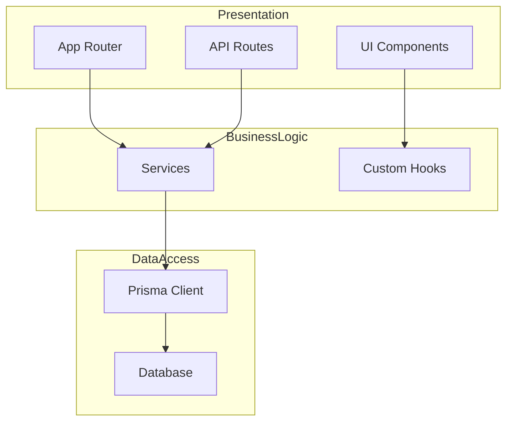
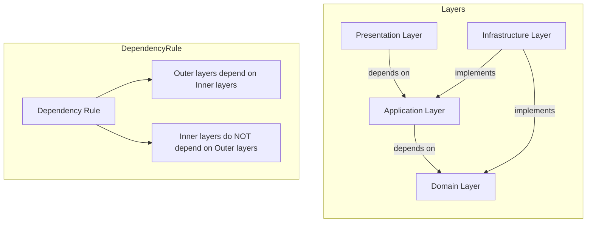
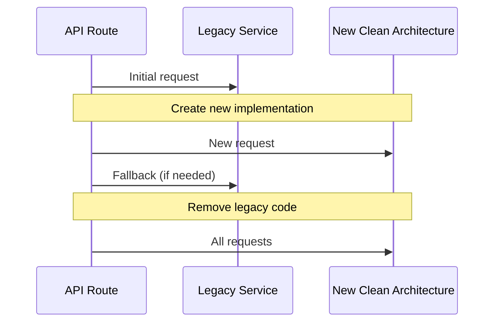

# Clean Architecture Migration Plan

## Overview

This document outlines the migration strategy for transitioning the Next.js Fullstack Starter project from its current mixed architecture state to a full Clean Architecture implementation.

## Current Architecture State

### Mixed Architecture

The project currently has a **hybrid architecture** with two distinct patterns:

#### 1. Clean Architecture (Partial - `src/`)

The `src/` directory implements Clean Architecture principles:



**Implemented Slices:**
- `notifications/` - Complete clean architecture implementation
- `reporting/` - Complete clean architecture implementation
- `user-management/` - Complete clean architecture implementation

#### 2. Traditional Layered Architecture (Legacy - `lib/`, `app/`, `components/`)

The rest of the project follows a traditional layered approach:



### Architecture Issues

| Issue | Impact | Location |
|-------|--------|----------|
| **Mixed Patterns** | Inconsistent code style, harder to maintain | Project-wide |
| **Tight Coupling** | Difficult to test, hard to swap implementations | `lib/services/` |
| **Business Logic in Services** | Domain logic scattered, no DDD principles | `lib/services/` |
| **No Domain Boundaries** | Feature overlap, unclear ownership | `lib/` |
| **Infrastructure Leakage** | Framework dependencies in business logic | `app/`, `components/` |
| **Missing Value Objects** | Primitive obsession, type safety issues | `lib/types/` |

## Target Architecture

### Clean Architecture Principles

The target architecture will follow Uncle Bob's Clean Architecture principles:



### Target Directory Structure

```
src/
├── shared/                          # Shared infrastructure and base classes
│   ├── domain/
│   │   ├── base/                    # Base classes (Entity, AggregateRoot, ValueObject)
│   │   └── exceptions/             # Domain exceptions
│   ├── application/
│   │   └── base/                   # Base classes (Command, Query, Handler, DTO)
│   ├── infrastructure/
│   │   ├── dependency-injection/    # DI container configuration
│   │   └── events/                 # Event bus implementation
│   └── presentation/
│       └── base/                    # Base classes (Controller, Middleware)
│
├── slices/                          # Feature-based organization (Bounded Contexts)
│   ├── auth/                       # Authentication & Authorization
│   │   ├── domain/
│   │   │   ├── entities/           # User, Session, Role, Permission
│   │   │   ├── value-objects/      # Email, PasswordHash, Token, Permission
│   │   │   ├── events/             # UserCreated, UserLoggedIn, PasswordChanged
│   │   │   ├── services/           # AuthService, PasswordService
│   │   │   ├── repositories/       # UserRepository, RoleRepository
│   │   │   └── index.ts
│   │   ├── application/
│   │   │   ├── commands/           # RegisterUser, Login, Logout, ChangePassword
│   │   │   ├── queries/            # GetUser, GetUsers, ValidateToken
│   │   │   ├── handlers/           # Command/Query handlers
│   │   │   ├── use-cases/          # Use case orchestrators
│   │   │   ├── dtos/              # Data Transfer Objects
│   │   │   └── index.ts
│   │   ├── infrastructure/
│   │   │   ├── repositories/       # PrismaUserRepository, etc.
│   │   │   ├── services/           # ClerkAuthService, etc.
│   │   │   ├── di/                 # DI container for auth slice
│   │   │   └── index.ts
│   │   └── presentation/
│   │       ├── controllers/         # AuthController
│   │       ├── middleware/          # AuthMiddleware
│   │       └── index.ts
│   │
│   ├── organizations/               # Multi-tenancy
│   │   ├── domain/
│   │   │   ├── entities/           # Organization, Member, Invite
│   │   │   ├── value-objects/      # OrganizationSlug, MemberRole
│   │   │   ├── events/             # OrganizationCreated, MemberAdded
│   │   │   ├── services/           # OrganizationService
│   │   │   ├── repositories/       # OrganizationRepository
│   │   │   └── index.ts
│   │   ├── application/
│   │   │   ├── commands/           # CreateOrganization, AddMember, InviteUser
│   │   │   ├── queries/            # GetOrganization, GetMembers
│   │   │   ├── handlers/
│   │   │   ├── use-cases/
│   │   │   ├── dtos/
│   │   │   └── index.ts
│   │   ├── infrastructure/
│   │   │   ├── repositories/
│   │   │   ├── services/
│   │   │   ├── di/
│   │   │   └── index.ts
│   │   └── presentation/
│   │       ├── controllers/
│   │       └── index.ts
│   │
│   ├── reports/                    # Reports System (already implemented)
│   ├── notifications/              # Notifications (already implemented)
│   ├── analytics/                  # Analytics Dashboards
│   ├── workflows/                  # Workflow Management
│   ├── integrations/               # Integration Hub
│   ├── collaboration/              # Real-time Collaboration
│   ├── mobile/                     # Mobile Features
│   └── security/                   # Security & Compliance
│
├── __tests__/                      # Test files organized by slice
│   ├── unit/
│   ├── integration/
│   └── e2e/
│
└── index.ts                        # Main entry point
```

### Layer Responsibilities

#### Domain Layer (Innermost)

**Responsibilities:**
- Define business entities and value objects
- Implement business rules and invariants
- Define domain events
- Implement domain services (stateless business logic)
- Define repository interfaces (contracts)

**Characteristics:**
- No external dependencies
- Pure TypeScript/JavaScript
- Framework-agnostic
- Testable without infrastructure

#### Application Layer

**Responsibilities:**
- Orchestrate use cases
- Handle commands and queries (CQRS)
- Coordinate domain services
- Define DTOs for data transfer
- Implement application services

**Characteristics:**
- Depends only on Domain layer
- No framework dependencies
- Transaction management
- Use case orchestration

#### Infrastructure Layer

**Responsibilities:**
- Implement repository interfaces
- Integrate with external services
- Handle persistence (Prisma, Redis, etc.)
- Implement event bus
- Provide concrete implementations

**Characteristics:**
- Implements interfaces from Domain and Application
- Contains framework-specific code
- Can be swapped without affecting business logic

#### Presentation Layer (Outermost)

**Responsibilities:**
- Handle HTTP requests (API routes)
- Present data to UI
- Validate input
- Handle authentication/authorization
- Map to/from DTOs

**Characteristics:**
- Depends on Application layer
- Contains framework-specific code (Next.js)
- Thin layer, minimal business logic

## Migration Strategy

### Migration Phases

The migration will be executed in **6 phases** to minimize disruption and allow incremental progress:

#### Phase 1: Foundation (Setup & Patterns)

**Goal:** Establish the foundation for clean architecture migration.

**Tasks:**
- [ ] Define coding standards for clean architecture
- [ ] Create base classes and interfaces
- [ ] Set up dependency injection framework
- [ ] Configure event bus implementation
- [ ] Create migration utilities and helpers

**Deliverables:**
- Base Entity, AggregateRoot, ValueObject classes
- Base Command, Query, Handler classes
- DI container configuration
- Event bus implementation
- Migration guide document

**Duration:** Foundation setup

#### Phase 2: Core Slices Migration

**Goal:** Migrate core business functionality to clean architecture.

**Slices to Migrate:**
- `auth/` - Authentication & Authorization
- `organizations/` - Multi-tenancy
- `users/` - User management

**Tasks:**
- [ ] Define domain entities and value objects
- [ ] Create repository interfaces
- [ ] Implement domain services
- [ ] Create commands and queries
- [ ] Implement handlers and use cases
- [ ] Create infrastructure implementations
- [ ] Implement presentation layer
- [ ] Write comprehensive tests
- [ ] Update API routes to use new architecture

**Deliverables:**
- Complete clean architecture implementation for core slices
- Updated API routes
- Test coverage for migrated slices
- Migration documentation

**Duration:** Core slices migration

#### Phase 3: Business Features Migration

**Goal:** Migrate business-critical features to clean architecture.

**Slices to Migrate:**
- `analytics/` - Analytics dashboards
- `workflows/` - Workflow management
- `integrations/` - Integration hub
- `collaboration/` - Real-time collaboration

**Tasks:**
- [ ] Define bounded contexts for each slice
- [ ] Create domain models
- [ ] Implement application layer
- [ ] Create infrastructure implementations
- [ ] Implement presentation layer
- [ ] Write tests
- [ ] Update UI components

**Deliverables:**
- Clean architecture implementation for business features
- Updated UI components
- Test coverage

**Duration:** Business features migration

#### Phase 4: Supporting Features Migration

**Goal:** Migrate supporting and infrastructure features.

**Slices to Migrate:**
- `mobile/` - Mobile features
- `security/` - Security & compliance
- `notifications/` - Enhance existing implementation
- `reports/` - Enhance existing implementation

**Tasks:**
- [ ] Migrate mobile features (push notifications, offline sync)
- [ ] Migrate security features (MFA, RBAC, audit logs)
- [ ] Enhance existing clean architecture implementations
- [ ] Update infrastructure services

**Deliverables:**
- Clean architecture implementation for supporting features
- Enhanced existing slices

**Duration:** Supporting features migration

#### Phase 5: Legacy Code Cleanup

**Goal:** Remove or refactor legacy code that cannot be migrated.

**Tasks:**
- [ ] Identify code that cannot be migrated
- [ ] Create deprecation plan for legacy code
- [ ] Refactor utility functions to appropriate layers
- [ ] Remove duplicate implementations
- [ ] Clean up unused dependencies

**Deliverables:**
- Cleaned up codebase
- Removed legacy code
- Updated dependencies

**Duration:** Legacy cleanup

#### Phase 6: Documentation & Finalization

**Goal:** Complete documentation and finalize migration.

**Tasks:**
- [ ] Update architecture documentation
- [ ] Create developer guides
- [ ] Update API documentation
- [ ] Create testing guidelines
- [ ] Update README
- [ ] Create migration summary

**Deliverables:**
- Complete architecture documentation
- Developer guides
- API documentation
- Migration summary document

**Duration:** Documentation

### Migration Priorities

| Priority | Slice | Reason |
|----------|-------|--------|
| 1 | `auth/` | Core functionality, everything depends on it |
| 2 | `organizations/` | Multi-tenancy foundation |
| 3 | `users/` | User management core |
| 4 | `analytics/` | Business-critical feature |
| 5 | `workflows/` | Business-critical feature |
| 6 | `integrations/` | Business-critical feature |
| 7 | `collaboration/` | Important feature |
| 8 | `mobile/` | Supporting feature |
| 9 | `security/` | Supporting feature |
| 10 | `notifications/` | Enhance existing |
| 11 | `reports/` | Enhance existing |

### Migration Techniques

#### 1. Strangler Fig Pattern

Gradually replace legacy code by creating new clean architecture implementations alongside existing code, then switching over.



#### 2. Adapter Pattern

Create adapters to bridge between legacy code and new clean architecture.

```typescript
// Legacy code
class LegacyUserService {
  async getUser(id: string) {
    return prisma.user.findUnique({ where: { id } });
  }
}

// Adapter
class UserServiceAdapter implements IUserRepository {
  constructor(private legacyService: LegacyUserService) {}

  async findById(id: UniqueId): Promise<User | null> {
    const user = await this.legacyService.getUser(id.value);
    return user ? User.fromPrisma(user) : null;
  }
}
```

#### 3. Facade Pattern

Create facades to simplify complex legacy interactions.

```typescript
class OrganizationFacade {
  constructor(
    private orgService: OrganizationService,
    private memberService: MemberService,
    private inviteService: InviteService
  ) {}

  async createOrganizationWithOwner(data: CreateOrganizationDTO) {
    const org = await this.orgService.create(data);
    await this.memberService.addOwner(org.id, data.ownerId);
    return org;
  }
}
```

## Risk Mitigation

### Risks

| Risk | Impact | Mitigation |
|------|--------|------------|
| Breaking existing functionality | High | Comprehensive testing, gradual rollout |
| Long migration timeline | Medium | Incremental phases, parallel development |
| Team learning curve | Medium | Training, documentation, pair programming |
| Performance regression | Medium | Performance testing, optimization |
| Incomplete migration | High | Clear exit criteria, regular reviews |

### Testing Strategy

1. **Unit Tests** - Test domain logic in isolation
2. **Integration Tests** - Test slice interactions
3. **E2E Tests** - Test complete user flows
4. **Contract Tests** - Ensure API compatibility
5. **Performance Tests** - Monitor performance impact

## Success Criteria

### Technical Success Criteria

- [ ] All slices follow clean architecture principles
- [ ] Domain layer has no external dependencies
- [ ] Application layer depends only on domain
- [ ] Infrastructure implements domain/application interfaces
- [ ] Presentation layer is thin and framework-specific
- [ ] Test coverage > 80%
- [ ] No circular dependencies
- [ ] Clear bounded contexts

### Business Success Criteria

- [ ] No breaking changes to existing APIs
- [ ] Performance maintained or improved
- [ ] Development velocity maintained or improved
- [ ] Code maintainability improved
- [ ] Team satisfaction with new architecture

## Next Steps

1. Review and approve this migration plan
2. Set up migration working group
3. Begin Phase 1: Foundation
4. Create detailed task breakdown for Phase 2
5. Establish regular progress reviews

## References

- Clean Architecture by Robert C. Martin
- Domain-Driven Design by Eric Evans
- Implementing Domain-Driven Design by Vaughn Vernon
- Clean Architecture in TypeScript blog posts
- Next.js documentation
