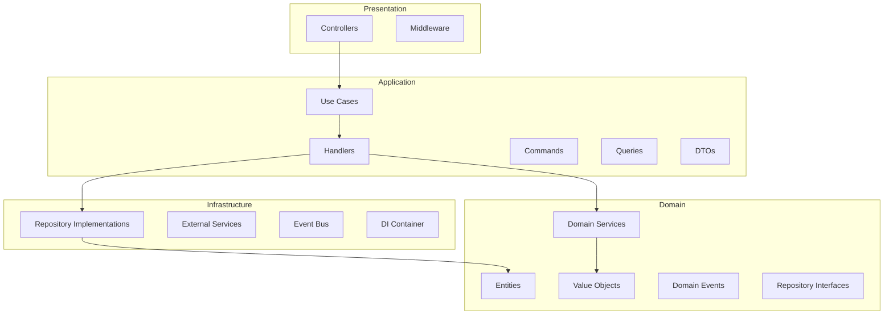
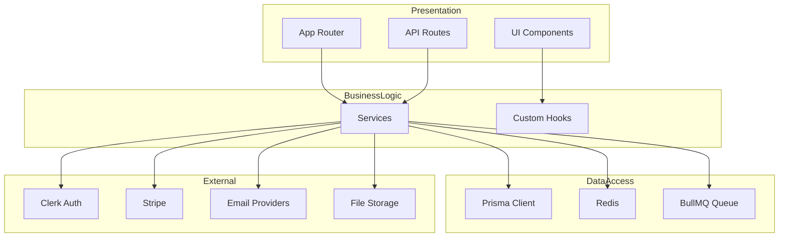
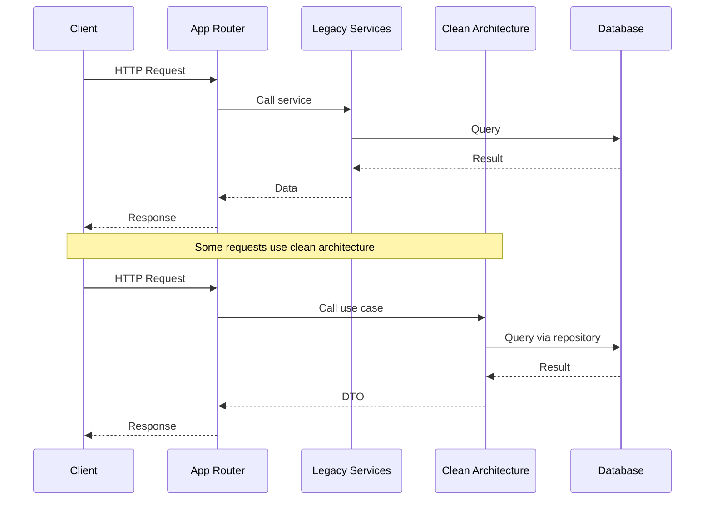

# Current Architecture Overview

## Executive Summary

This document provides a comprehensive overview of the Next.js Fullstack Starter project's current architecture state. The project has a **hybrid architecture** combining Clean Architecture principles in the `src/` directory with traditional layered architecture in the rest of the codebase.

## Project Structure

### High-Level Directory Structure

```
nextjs-fullstack-starter/
├── src/                          # Clean Architecture (partial implementation)
│   ├── shared/                    # Shared base classes and infrastructure
│   ├── slices/                    # Feature-based bounded contexts
│   └── __tests__/                # Test files
│
├── lib/                          # Legacy: Business logic and utilities
│   ├── services/                  # Business services
│   ├── cache/                     # Caching layer
│   ├── email/                     # Email services
│   ├── monitoring/                # Monitoring and metrics
│   ├── queue/                     # Job queue
│   ├── security/                  # Security utilities
│   ├── types/                     # TypeScript types
│   └── utils/                    # Utility functions
│
├── app/                          # Next.js App Router (presentation)
├── components/                   # UI components (presentation)
├── actions/                      # Server actions
├── api/                          # API routes
├── hooks/                        # React hooks
├── prisma/                       # Database schema and migrations
├── public/                       # Static assets
├── docs/                         # Documentation
└── tests/                        # Root-level tests
```

## Architecture Patterns

### 1. Clean Architecture (src/)

The `src/` directory implements Clean Architecture principles with feature-based organization (slices).

#### Directory Structure

```
src/
├── shared/
│   ├── domain/
│   │   ├── base/
│   │   │   ├── aggregate-root.ts
│   │   │   ├── domain-event.ts
│   │   │   ├── entity.ts
│   │   │   └── index.ts
│   │   ├── exceptions/
│   │   │   ├── business-rule-violation-error.ts
│   │   │   ├── domain-error.ts
│   │   │   ├── not-found-error.ts
│   │   │   ├── validation-error.ts
│   │   │   └── index.ts
│   │   └── index.ts
│   │
│   ├── application/
│   │   ├── base/
│   │   │   ├── application-service.ts
│   │   │   ├── command-handler.ts
│   │   │   ├── command.ts
│   │   │   ├── dto.ts
│   │   │   ├── query-handler.ts
│   │   │   └── index.ts
│   │   └── index.ts
│   │
│   ├── infrastructure/
│   │   ├── dependency-injection/
│   │   │   ├── container.ts
│   │   │   └── index.ts
│   │   ├── events/
│   │   │   ├── event-bus.ts
│   │   │   └── index.ts
│   │   └── index.ts
│   │
│   └── presentation/
│       ├── base/
│       │   ├── base-controller.ts
│       │   └── index.ts
│       └── index.ts
│
├── slices/
│   ├── notifications/
│   │   ├── domain/
│   │   │   ├── entities/
│   │   │   │   └── notification.ts
│   │   │   ├── events/
│   │   │   │   ├── notification-archived-event.ts
│   │   │   │   ├── notification-created-event.ts
│   │   │   │   ├── notification-failed-event.ts
│   │   │   │   ├── notification-read-event.ts
│   │   │   │   └── notification-sent-event.ts
│   │   │   ├── services/
│   │   │   │   ├── notification-delivery-service.ts
│   │   │   │   └── notification-routing-service.ts
│   │   │   └── value-objects/
│   │   │       ├── notification-channel.ts
│   │   │       └── notification-preferences.ts
│   │   ├── application/
│   │   │   ├── commands/
│   │   │   ├── queries/
│   │   │   ├── handlers/
│   │   │   ├── use-cases/
│   │   │   └── dtos/
│   │   ├── infrastructure/
│   │   │   ├── repositories/
│   │   │   ├── services/
│   │   │   └── di/
│   │   └── presentation/
│   │       └── controllers/
│   │
│   ├── reporting/
│   │   ├── domain/
│   │   │   ├── entities/
│   │   │   ├── services/
│   │   │   └── value-objects/
│   │   ├── application/
│   │   │   ├── commands/
│   │   │   ├── queries/
│   │   │   ├── handlers/
│   │   │   ├── use-cases/
│   │   │   └── dtos/
│   │   ├── infrastructure/
│   │   │   ├── repositories/
│   │   │   ├── services/
│   │   │   └── di/
│   │   └── presentation/
│   │       └── controllers/
│   │
│   └── user-management/
│       ├── domain/
│       ├── application/
│       ├── infrastructure/
│       └── presentation/
│
└── __tests__/
    ├── unit/
    ├── integration/
    └── smoke/
```

#### Implemented Slices

| Slice | Status | Description |
|-------|--------|-------------|
| `notifications/` | Complete | Notification management with delivery and routing |
| `reporting/` | Complete | Report creation, templates, scheduled reports, exports |
| `user-management/` | Complete | User CRUD operations |

#### Clean Architecture Layers



### 2. Traditional Layered Architecture (lib/)

The `lib/` directory follows a traditional layered approach with business logic in services.

#### Directory Structure

```
lib/
├── services/                      # Business logic services
│   ├── analytics-service.ts
│   ├── audit.ts
│   ├── compliance.ts
│   ├── email-service.ts
│   ├── export-processor.ts
│   ├── export-service.ts
│   ├── file-storage-service.ts
│   ├── notification-service.ts
│   ├── organization-service.ts
│   ├── queue-service.ts
│   ├── report-service.ts
│   ├── report-templates-service.ts
│   ├── scheduled-reports-service.ts
│   ├── scheduled-reports.ts
│   ├── scheduled-usage-jobs.ts
│   ├── security-service.ts
│   ├── template-service.ts
│   ├── usage-tracking-service.ts
│   ├── usage-tracking.ts
│   └── queue/
│
├── cache/                         # Caching layer
│   ├── cache-service.ts
│   └── index.ts
│
├── email/                         # Email services
│   ├── email-service.ts
│   ├── types.ts
│   └── providers/
│       ├── base-provider.ts
│       ├── mock-provider.ts
│       ├── resend-provider.ts
│       └── sendgrid-provider.ts
│
├── monitoring/                    # Monitoring and metrics
│   ├── alerts.ts
│   ├── health-checks.ts
│   ├── metrics-collector.ts
│   ├── performance-monitor.ts
│   └── index.ts
│
├── queue/                         # Job queue (BullMQ)
│   ├── config.ts
│   ├── queue-manager.ts
│   ├── worker-init.ts
│   └── workers/
│       ├── email-worker.ts
│       ├── export-worker.ts
│       └── notification-worker.ts
│
├── security/                      # Security utilities
│   ├── advanced-validation.ts
│   ├── api-key-manager.ts
│   ├── audit.ts
│   ├── brute-force-protection.ts
│   ├── cors-config.ts
│   ├── encryption.ts
│   ├── enhanced-validation.ts
│   ├── mfa.ts
│   ├── monitoring.ts
│   ├── permission-audit.ts
│   ├── rate-limiter.ts
│   ├── rate-limiting.ts
│   ├── rbac.ts
│   ├── request-validator.ts
│   ├── security-audit.ts
│   ├── security-headers.ts
│   ├── security-middleware.ts
│   ├── security-monitor.ts
│   └── index.ts
│
├── types/                         # TypeScript types
│   ├── analytics.ts
│   ├── audit.ts
│   ├── integrations.ts
│   ├── organizations.ts
│   ├── reports.ts
│   ├── scheduled-reports.ts
│   ├── security.ts
│   └── workflows.ts
│
├── utils/                         # Utility functions
│   ├── api-retry.ts
│   ├── cron-utils.ts
│   ├── rate-limiter.ts
│   ├── request-helpers.ts
│   ├── scheduled-reports-validation.ts
│   └── type-helpers.ts
│
├── pdf/                           # PDF generation
│   ├── index.ts
│   ├── pdf-generator.ts
│   ├── pdf-service.ts
│   └── templates/
│
├── push/                          # Push notifications
│   ├── push-service.ts
│   └── index.ts
│
├── offline/                        # Offline support
│   ├── conflict-resolution.ts
│   ├── indexeddb.ts
│   └── sync-service.ts
│
├── performance/                    # Performance utilities
│   ├── lazy-components.tsx
│   └── memoization.ts
│
├── mobile/                        # Mobile utilities
│   ├── code-splitting.ts
│   ├── performance.ts
│   └── service-worker.ts
│
├── socket/                        # WebSocket support
│   └── server.ts
│
└── Core files
    ├── api-utils.ts
    ├── auth-clerk.ts
    ├── auth-helpers.ts
    ├── auth-nextauth.ts
    ├── auth-session.ts
    ├── auth.ts
    ├── conditional-auth.ts
    ├── constants.ts
    ├── current-profile.ts
    ├── db.ts
    ├── email.ts
    ├── error-handlers.ts
    ├── index.ts
    ├── initial-profile.ts
    ├── logger.ts
    ├── notifications.ts
    ├── permissions.ts
    ├── prisma.ts
    ├── react-query.tsx
    ├── routes.ts
    ├── seo.ts
    ├── standardized-error-responses.ts
    ├── startup.ts
    ├── stripe-client.ts
    ├── stripe.ts
    ├── subscription-middleware.ts
    ├── subscription-service.ts
    ├── uploadthing.ts
    ├── utils.ts
    └── validations.ts
```

#### Traditional Layered Architecture



### 3. Presentation Layer (app/, components/, api/)

#### App Directory (Next.js App Router)

```
app/
├── (auth)/                        # Authentication routes
├── (dashboard)/                   # Dashboard routes
├── analytics/                     # Analytics pages
├── api/                          # API routes
├── audit/                         # Audit pages
├── docs/                          # Documentation pages
├── install/                       # Installation pages
├── reports/                       # Reports pages
├── showcase/                      # Showcase pages
├── sign-out/                      # Sign out page
├── error.tsx                      # Error boundary
├── globals.css                    # Global styles
├── layout.tsx                     # Root layout
├── loading.tsx                    # Loading state
├── not-found.tsx                  # Not found page
├── page.tsx                       # Home page
├── robots.ts                      # SEO robots.txt
└── sitemap.ts                     # SEO sitemap.xml
```

#### Components Directory

```
components/
├── analytics/                     # Analytics components
├── audit/                         # Audit components
├── collaboration/                  # Collaboration components
├── dashboard/                     # Dashboard components
├── drag-drop/                     # Drag and drop components
├── error-boundary/                 # Error boundary components
├── forms/                         # Form components
├── integrations/                   # Integration components
├── mobile/                        # Mobile components
├── modals/                        # Modal components
├── organizations/                  # Organization components
├── providers/                     # Context providers
├── reports/                       # Report components
├── scheduled-reports/              # Scheduled report components
├── security/                      # Security components
├── ui/                           # shadcn/ui components
├── usage/                        # Usage tracking components
├── workflows/                     # Workflow components
└── [root-level components]
    ├── breadcrumb.tsx
    ├── conditional-clerk.tsx
    ├── email-demo.tsx
    ├── file-upload.tsx
    ├── image-upload.tsx
    ├── navbar.tsx
    ├── notification-center.tsx
    ├── pagination-demo.tsx
    ├── pricing-cards.tsx
    ├── realtime-demo.tsx
    ├── seo-demo.tsx
    ├── structured-data.tsx
    ├── subscription-demo.tsx
    ├── subscription-status.tsx
    ├── theme-toggle.tsx
    └── upload-demo.tsx
```

#### API Routes

```
api/
├── [various endpoints]
```

### 4. Hooks Directory

```
hooks/
├── use-push-notifications.ts
├── use-report-builder.ts
├── use-report-permissions.ts
├── use-request.ts
├── use-scheduled-reports-realtime.ts
├── use-scheduled-reports.ts
└── use-seo.ts
```

### 5. Database Layer (prisma/)

```
prisma/
├── schema.prisma                 # Database schema
└── seed.ts                       # Database seeding
```

## Data Flow

### Current Data Flow (Mixed)



## Architecture Issues

### 1. Mixed Patterns

**Problem:** The project uses two different architectural patterns simultaneously.

**Impact:**
- Inconsistent code style
- Confusing for developers
- Harder to maintain
- Unclear where to put new code

**Locations:**
- `src/` - Clean Architecture
- `lib/` - Traditional Layered

### 2. Tight Coupling

**Problem:** Services are tightly coupled to external dependencies.

**Impact:**
- Difficult to test
- Hard to swap implementations
- Business logic mixed with infrastructure

**Example:**
```typescript
// lib/services/report-service.ts
import { prisma } from '@/lib/prisma';  // Tight coupling to Prisma

export class ReportService {
  async getReport(id: string) {
    return prisma.report.findUnique({ where: { id } });  // Direct DB access
  }
}
```

### 3. Business Logic in Services

**Problem:** Domain logic is scattered in service classes without proper domain modeling.

**Impact:**
- No clear domain boundaries
- Business rules not encapsulated
- Difficult to enforce invariants

**Example:**
```typescript
// lib/services/organization-service.ts
export class OrganizationService {
  async addMember(orgId: string, userId: string, role: string) {
    // Business logic mixed with infrastructure
    const org = await prisma.organization.findUnique({ where: { id: orgId } });
    if (!org) throw new Error('Organization not found');

    const members = await prisma.organizationMember.count({ where: { organizationId: orgId } });
    if (members >= org.maxMembers) {
      throw new Error('Organization is full');
    }

    return prisma.organizationMember.create({
      data: { organizationId: orgId, userId, role }
    });
  }
}
```

### 4. No Domain Boundaries

**Problem:** Features overlap and ownership is unclear.

**Impact:**
- Duplicate code
- Unclear responsibilities
- Difficult to reason about

**Example:**
- `lib/services/notification-service.ts` - Notification logic
- `lib/notifications.ts` - More notification logic
- `src/slices/notifications/` - Clean architecture notifications

### 5. Infrastructure Leakage

**Problem:** Framework and infrastructure dependencies leak into business logic.

**Impact:**
- Business logic depends on frameworks
- Difficult to test
- Hard to change implementations

**Example:**
```typescript
// app/api/reports/route.ts
import { ReportService } from '@/lib/services/report-service';
import { prisma } from '@/lib/prisma';

export async function GET(request: Request) {
  const { searchParams } = new URL(request.url);
  const reports = await prisma.report.findMany({
    where: { organizationId: searchParams.get('orgId') }
  });
  return Response.json(reports);
}
```

### 6. Missing Value Objects

**Problem:** Types are simple TypeScript types, not value objects with behavior.

**Impact:**
- Primitive obsession
- Type safety issues
- No encapsulation of business rules

**Example:**
```typescript
// lib/types/reports.ts
export type ReportStatus = 'draft' | 'published' | 'archived';
export type ReportConfig = {
  title: string;
  filters: Record<string, any>;
};

// Should be value objects with behavior
```

## Technology Stack

| Layer | Technology | Purpose |
|-------|-----------|---------|
| Framework | Next.js 14 | Fullstack framework |
| Language | TypeScript 5.3 | Type safety |
| Database | PostgreSQL 15 | Primary database |
| ORM | Prisma 5 | Database access |
| Auth | Clerk 5.6 | Authentication |
| State | React Query 5 | Server state |
| Styling | Tailwind CSS 3 | UI styling |
| UI | shadcn/ui | Component library |
| Queue | BullMQ | Job queue |
| Cache | Redis | Caching |
| Testing | Jest | Testing framework |
| DI | Inversify | Dependency injection |

## Summary

The Next.js Fullstack Starter project has a sophisticated feature set but suffers from a mixed architecture state. The `src/` directory demonstrates proper Clean Architecture implementation with feature-based organization, while the rest of the codebase follows traditional layered architecture patterns.

Key areas for improvement:
1. Unify architecture patterns
2. Establish clear domain boundaries
3. Separate business logic from infrastructure
4. Implement value objects for type safety
5. Reduce coupling between layers

The migration plan in [`clean-architecture-migration-plan.md`](./clean-architecture-migration.md) provides a roadmap for transitioning the entire codebase to Clean Architecture.
