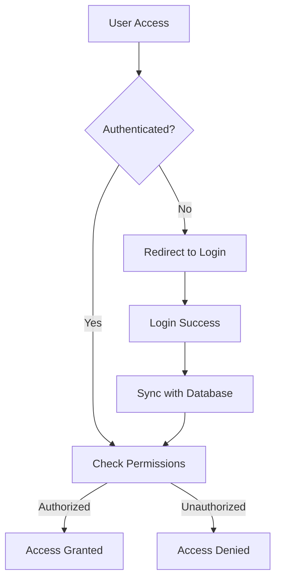

# Architecture Overview

This document provides a comprehensive overview of the FullStack Base Template architecture, explaining the design decisions, patterns, and structure.

## 🏗️ Architecture Principles

### 1. **Separation of Concerns**
- Clear separation between UI, business logic, and data layers
- Modular component architecture
- Dedicated directories for different concerns (components, hooks, lib, etc.)

### 2. **Type Safety**
- TypeScript throughout the entire application
- Zod schemas for runtime validation
- Prisma for type-safe database operations
- Strict TypeScript configuration

### 3. **Scalability**
- Modular architecture that supports feature growth
- Clean abstractions for easy extension
- Efficient state management with Zustand
- Optimized database queries with React Query

### 4. **Performance**
- Server-side rendering with Next.js App Router
- Efficient client-side caching with React Query
- Optimized images and static assets
- Code splitting and lazy loading

### 5. **Developer Experience**
- Hot reloading for fast development
- Comprehensive TypeScript support
- ESLint and Prettier for code quality
- Rich development tools and debugging

## 📱 Frontend Architecture

### Next.js App Router Structure

```
app/
├── (auth)/                 # Route groups for authentication
│   ├── sign-in/
│   └── sign-up/
├── (dashboard)/            # Protected dashboard routes
│   ├── dashboard/
│   ├── posts/
│   ├── users/
│   └── settings/
├── api/                    # API routes
│   ├── auth/
│   ├── posts/
│   ├── users/
│   └── upload/
├── globals.css             # Global styles
├── layout.tsx              # Root layout
└── page.tsx                # Home page
```

### Component Architecture

```
components/
├── ui/                     # Base UI components (shadcn/ui)
│   ├── button.tsx
│   ├── input.tsx
│   ├── modal.tsx
│   └── ...
├── forms/                  # Form-specific components
│   ├── login-form.tsx
│   ├── post-form.tsx
│   └── ...
├── modals/                 # Modal components
│   ├── create-post-modal.tsx
│   ├── delete-confirm-modal.tsx
│   └── ...
└── layout/                 # Layout components
    ├── navbar.tsx
    ├── sidebar.tsx
    └── footer.tsx
```

### State Management Layers

#### 1. **Server State (React Query)**
- API data caching and synchronization
- Background updates and refetching
- Optimistic updates
- Error handling and retry logic

#### 2. **Client State (Zustand)**
- UI state (modals, sidebar, theme)
- User preferences
- Form state
- Temporary application state

#### 3. **URL State (Next.js Router)**
- Navigation state
- Search parameters
- Filter and pagination state

## 🔧 Backend Architecture

### API Layer Structure

```
app/api/
├── auth/                   # Authentication endpoints
│   ├── login/
│   ├── register/
│   └── me/
├── posts/                  # Post management
│   ├── route.ts           # GET /api/posts, POST /api/posts
│   └── [id]/
│       ├── route.ts       # GET, PUT, DELETE /api/posts/[id]
│       └── comments/
│           └── route.ts   # GET, POST /api/posts/[id]/comments
├── users/                  # User management
├── categories/             # Category management
├── tags/                   # Tag management
├── upload/                 # File upload handling
└── webhook/                # External webhooks
```

### API Design Patterns

#### 1. **Consistent Response Format**
```typescript
interface ApiResponse<T = any> {
  success: boolean;
  data?: T;
  error?: string;
  message?: string;
}
```

#### 2. **Error Handling**
- Custom `ApiError` class for consistent error handling
- Validation error formatting with Zod
- HTTP status code standardization
- Comprehensive error logging

#### 3. **Request Validation**
- Zod schemas for runtime validation
- Type-safe request parsing
- Consistent validation error responses
- Input sanitization

#### 4. **Authentication Middleware**
- JWT token validation
- Role-based access control
- Route protection
- User context injection

## 🗃️ Database Architecture

### Schema Design

The database schema follows these principles:

#### 1. **Normalized Structure**
- Proper relationships between entities
- Foreign key constraints
- Junction tables for many-to-many relationships

#### 2. **Flexible Content Model**
- Generic post/content structure
- Category and tag system
- User-generated content support
- Media attachment support

#### 3. **Audit Trail**
- `createdAt` and `updatedAt` timestamps
- User attribution for all content
- Soft delete capabilities (where needed)

### Entity Relationships

```
User (1) ----< (M) Post (M) >---- (M) Category
 |                   |
 |                   |
 v                   v
Follow (M)      Comment (1) ----< (M) Comment (self-reference)
 |                   |
 |                   |
 v                   v
Notification    Like (M) ----< (1) User
```

### Database Providers Support

The schema is designed to work with multiple database providers:

- **PostgreSQL** (Primary) - Full feature support
- **MySQL** - Compatible with relation mode
- **SQLite** - Development and testing only

## 🔐 Authentication Architecture

### Multi-Provider Support

The template supports two authentication strategies:

#### 1. **Clerk (Primary)**
- Complete authentication solution
- Built-in UI components
- Social login providers
- User management dashboard
- Webhooks for user events

#### 2. **NextAuth.js (Alternative)**
- Flexible authentication library
- Custom login flows
- Multiple provider support
- JWT or database sessions
- Custom callbacks and events

### Authentication Flow



### User Synchronization

- Automatic user profile creation/update
- Database sync with authentication provider
- Role and permission management
- Profile data enrichment

## 🚀 Performance Optimizations

### Frontend Optimizations

#### 1. **Code Splitting**
- Dynamic imports for large components
- Route-based code splitting with Next.js
- Lazy loading for non-critical features

#### 2. **Caching Strategies**
- React Query for server state caching
- Browser caching for static assets
- Service worker for offline support (optional)

#### 3. **Image Optimization**
- Next.js Image component
- WebP format support
- Responsive image loading
- Lazy loading by default

### Backend Optimizations

#### 1. **Database Queries**
- Prisma query optimization
- Proper indexing strategy
- N+1 query prevention
- Connection pooling

#### 2. **API Response Caching**
- Redis for session storage (optional)
- HTTP caching headers
- ETags for conditional requests

#### 3. **Asset Delivery**
- CDN integration support
- Static asset optimization
- Compression (gzip/brotli)

## 🛡️ Security Considerations

### Frontend Security

- XSS prevention with React's built-in protection
- CSRF protection with authentication tokens
- Content Security Policy headers
- Secure cookie configuration

### Backend Security

- SQL injection prevention with Prisma
- Input validation and sanitization
- Rate limiting implementation
- Authentication and authorization layers
- Environment variable security

### Database Security

- Connection string encryption
- User permission management
- Database access logs
- Backup and recovery procedures

## 🧪 Testing Strategy

### Frontend Testing
- Unit tests for components (Jest + React Testing Library)
- Integration tests for user flows
- E2E tests with Playwright (ready to implement)
- Visual regression testing (optional)

### Backend Testing
- API endpoint testing
- Database integration tests
- Authentication flow testing
- Error handling validation

### Quality Assurance
- TypeScript strict mode
- ESLint for code quality
- Prettier for code formatting
- Husky for git hooks (optional)

## 📊 Monitoring and Analytics

### Application Monitoring
- Error tracking (Sentry integration ready)
- Performance monitoring
- User analytics (privacy-focused)
- API usage metrics

### Database Monitoring
- Query performance tracking
- Connection pool monitoring
- Storage usage metrics
- Backup verification

## 🔄 Development Workflow

### Local Development
1. Environment setup with `.env.local`
2. Database migration and seeding
3. Hot reloading with fast refresh
4. Development tools and debugging

### Deployment Pipeline
1. Code quality checks (lint, type-check)
2. Test execution (unit, integration)
3. Build optimization
4. Database migration (production)
5. Application deployment
6. Health checks and rollback capability

## 📈 Scalability Considerations

### Horizontal Scaling
- Stateless API design
- Database connection pooling
- Load balancer ready
- CDN integration support

### Vertical Scaling
- Efficient resource utilization
- Memory optimization
- CPU-intensive task offloading
- Database query optimization

### Microservices Migration
- Modular code organization
- Clear API boundaries
- Database per service capability
- Event-driven communication ready

---

This architecture provides a solid foundation for building scalable, maintainable, and performant web applications while maintaining flexibility for future requirements and growth.