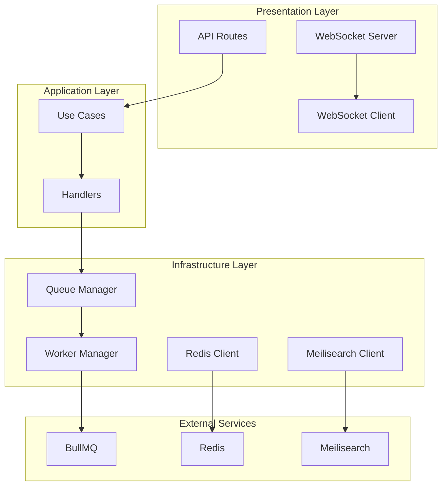
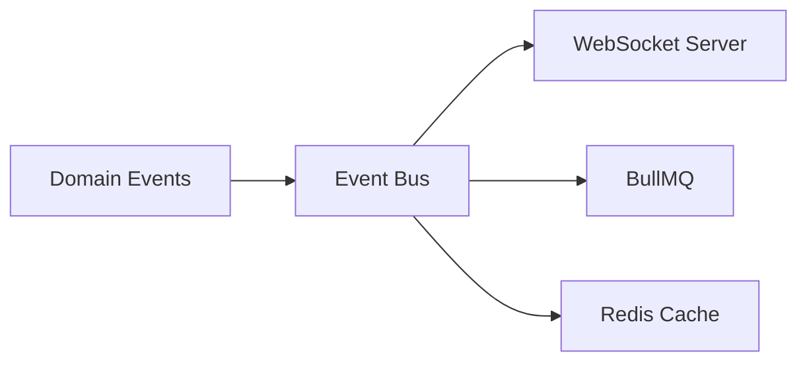

# Fase 5: Características Avanzadas - Plan de Implementación

**Fecha:** 2026-01-11
**Estado:** Planeado

## Objetivo

Implementar características avanzadas para mejorar la arquitectura del proyecto:
1. **Real-time Features** con WebSockets para comunicación en tiempo real
2. **Background Jobs** con BullMQ para procesamiento asíncrono
3. **Caching** con Redis para optimización de rendimiento
4. **Search** con Meilisearch para búsqueda avanzada

## Arquitectura Propuesta



## Tarea 1: Real-time Features con WebSockets

### Objetivos
- Implementar comunicación bidireccional en tiempo real
- Soportar múltiples tipos de eventos
- Manejo de conexión/reconexión automática
- Autenticación de conexiones WebSocket

### Componentes

#### 1.1 Servidor WebSocket

**Archivo:** `src/shared/infrastructure/websocket/websocket-server.ts`

**Responsabilidades:**
- Gestionar conexiones WebSocket
- Autenticar usuarios
- Broadcast de eventos
- Manejo de salas (rooms)
- Reconexión automática

**Interfaz:**
```typescript
interface IWebSocketServer {
  start(port: number): Promise<void>
  stop(): Promise<void>
  broadcast(event: string, data: any): void
  sendToClient(clientId: string, event: string, data: any): void
  getClientsCount(): number
}
```

#### 1.2 Cliente WebSocket (React Hook)

**Archivo:** `src/shared/infrastructure/websocket/websocket-client.ts`

**Responsabilidades:**
- Conectar al servidor WebSocket
- Suscribirse a eventos específicos
- Manejar reconexión automática
- Desconectar limpiamente

**Interfaz:**
```typescript
interface IWebSocketClient {
  connect(): void
  disconnect(): void
  subscribe<T>(eventType: string, handler: (event: T) => void): () => void
  emit<T>(eventType: string, data: T): void
  isConnected(): boolean
}
```

#### 1.3 Tipos de Eventos

**Archivo:** `src/shared/infrastructure/websocket/types.ts`

**Definiciones:**
```typescript
export enum WebSocketEventType {
  NOTIFICATION = 'notification',
  REPORT_UPDATE = 'report_update',
  USER_ACTIVITY = 'user_activity',
  WORKFLOW_STATUS = 'workflow_status',
  DASHBOARD_UPDATE = 'dashboard_update',
}
```

#### 1.4 Integración con Event Bus

- Conectar WebSocket Server con EventBus
- Publicar eventos de dominio vía WebSocket
- Suscribirse a eventos de dominio y retransmitir

### Dependencias

- `ws` (WebSocket library)
- `socket.io` (para servidor)
- `socket.io-client` (para cliente React)

## Tarea 2: Background Jobs con BullMQ

### Objetivos
- Procesar tareas asíncronas en segundo plano
- Retries automáticos para tareas fallidas
- Programación de tareas recurrentes
- Priorización de tareas

### Componentes

#### 2.1 Queue Manager

**Archivo:** `src/shared/infrastructure/queue/queue-manager.ts`

**Responsabilidades:**
- Crear y gestionar colas (queues)
- Agregar trabajos a colas
- Monitorear estado de colas
- Limpiar trabajos completados

**Interfaz:**
```typescript
interface IQueueManager {
  addJob<T>(queueName: string, job: T): Promise<Job>
  getJobStatus(jobId: string): Promise<JobStatus>
  getQueueStats(queueName: string): Promise<QueueStats>
  removeJob(jobId: string): Promise<void>
}
```

#### 2.2 Worker Manager

**Archivo:** `src/shared/infrastructure/queue/worker-manager.ts`

**Responsabilidades:**
- Crear y gestionar workers
- Procesar trabajos de colas
- Manejo de errores y retries
- Shutdown gracioso

**Interfaz:**
```typescript
interface IWorkerManager {
  startWorker(queueName: string): Promise<void>
  stopWorker(queueName: string): Promise<void>
  getWorkerStats(queueName: string): Promise<WorkerStats>
}
```

#### 2.3 Tipos de Trabajos

**Archivo:** `src/shared/infrastructure/queue/types.ts`

**Definiciones:**
```typescript
export enum JobPriority {
  LOW = 'low',
  NORMAL = 'normal',
  HIGH = 'high',
  CRITICAL = 'critical',
}

export enum JobStatus {
  PENDING = 'pending',
  PROCESSING = 'processing',
  COMPLETED = 'completed',
  FAILED = 'failed',
  RETRYING = 'retrying',
}
```

#### 2.4 Scheduler

**Archivo:** `src/shared/infrastructure/queue/scheduler.ts`

**Responsabilidades:**
- Programar trabajos recurrentes
- Cancelar trabajos programados
- Gestionar cron expressions

**Interfaz:**
```typescript
interface IScheduler {
  scheduleJob<T>(job: T, cronExpression: string): Promise<void>
  cancelJob(jobId: string): Promise<void>
  getScheduledJobs(): Promise<ScheduledJob[]>
}
```

### Dependencias

- `bullmq` (BullMQ para colas)
- `ioredis` (Cliente Redis para BullMQ)
- `cron` (Para programación de tareas)

## Tarea 3: Caching con Redis

### Objetivos
- Reducir carga en base de datos
- Cachear consultas frecuentes
- Implementar estrategias de invalidación (TTL, LRU)
- Cachear resultados de repositorios

### Componentes

#### 3.1 Cliente Redis

**Archivo:** `src/shared/infrastructure/cache/redis-client.ts`

**Responsabilidades:**
- Conectar a Redis
- Set/Get/Delete valores
- Expirar claves con TTL
- Pipeline de comandos

**Interfaz:**
```typescript
interface IRedisClient {
  connect(): Promise<void>
  disconnect(): Promise<void>
  get(key: string): Promise<string | null>
  set(key: string, value: string, options?: CacheOptions): Promise<void>
  del(key: string): Promise<void>
  exists(key: string): Promise<boolean>
}
```

#### 3.2 Cache Service

**Archivo:** `src/shared/infrastructure/cache/cache-service.ts`

**Responsabilidades:**
- Gestión de caché con estrategias
- Wrapper para operaciones de caché
- Logging de hits/misses
- Estadísticas de caché

**Interfaz:**
```typescript
interface ICacheService {
  get<T>(key: string, fetcher: () => Promise<T>): Promise<T>
  set<T>(key: string, value: T, options?: CacheOptions): Promise<void>
  del(key: string): Promise<void>
  invalidate(pattern: string): Promise<void>
  getStats(): Promise<CacheStats>
}
```

#### 3.3 Estrategias de Caché

**Archivo:** `src/shared/infrastructure/cache/cache-strategies/`

**Estrategias:**
- `TTLStrategy` - Time To Live
- `LRUStrategy` - Least Recently Used
- `WriteThroughStrategy` - Write Through

**Archivo:** `src/shared/infrastructure/cache/types.ts`

**Definiciones:**
```typescript
export enum CacheStrategy {
  TTL = 'ttl',
  LRU = 'lru',
  WRITE_THROUGH = 'write_through',
}

export interface CacheOptions {
  ttl?: number;
  strategy?: CacheStrategy;
}
```

#### 3.4 Repositorios con Caché

**Archivo:** `src/shared/infrastructure/repositories/cached-repository.ts`

**Responsabilidades:**
- Wrapper para repositorios con caché
- Caché de resultados de consultas
- Invalidación automática

**Interfaz:**
```typescript
interface ICachedRepository<T> extends IRepository<T> {
  findByIdWithCache(id: string): Promise<T | null>;
  findManyWithCache(criteria: any): Promise<T[]>;
  invalidate(id: string): Promise<void>;
  invalidatePattern(pattern: string): Promise<void>;
}
```

### Dependencias

- `ioredis` (Cliente Redis)
- `bull-board` (Dashboard para BullMQ)

## Tarea 4: Search con Meilisearch

### Objetivos
- Búsqueda full-text en reportes
- Búsqueda de usuarios y organizaciones
- Filtros avanzados y facets
- Paginación eficiente
- Highlight de resultados

### Componentes

#### 4.1 Cliente Meilisearch

**Archivo:** `src/shared/infrastructure/search/meilisearch-client.ts`

**Responsabilidades:**
- Conectar a Meilisearch
- Indexar documentos
- Buscar con filtros
- Paginar resultados
- Highlight de términos

**Interfaz:**
```typescript
interface IMeilisearchClient {
  connect(): Promise<void>
  disconnect(): Promise<void>
  index<T>(indexName: string, documents: T[]): Promise<void>
  search<T>(indexName: string, query: SearchQuery, options?: SearchOptions): Promise<SearchResult<T>>;
  delete(indexName: string, id: string): Promise<void>
  getDocument(indexName: string, id: string): Promise<T>;
}
```

#### 4.2 Search Service

**Archivo:** `src/shared/infrastructure/search/search-service.ts`

**Responsabilidades:**
- Orquestar búsquedas a Meilisearch
- Combinar resultados de múltiples índices
- Manejo de errores y retries
- Logging de consultas

**Interfaz:**
```typescript
interface ISearchService {
  search<T>(query: SearchQuery): Promise<SearchResult<T>>;
  multiSearch<T>(queries: SearchQuery[]): Promise<MultiSearchResult>;
  suggest<T>(prefix: string): Promise<Suggestion[]>;
}
```

#### 4.3 Tipos de Búsqueda

**Archivo:** `src/shared/infrastructure/search/types.ts`

**Definiciones:**
```typescript
export enum SearchOperator {
  AND = 'and',
  OR = 'or',
  NOT = 'not',
}

export interface SearchQuery {
  query: string;
  filters?: SearchFilter[];
  page?: number;
  pageSize?: number;
  sortBy?: string;
  sortDirection?: 'asc' | 'desc';
}

export interface SearchFilter {
  field: string;
  operator: SearchOperator;
  value: any;
}

export interface SearchOptions {
  highlight?: boolean;
  facets?: string[];
}

export interface SearchResult<T> {
  results: T[];
  total: number;
  page: number;
  pageSize: number;
  took: number;
}

export interface Suggestion {
  text: string;
  score: number;
}
```

#### 4.4 Repositorios con Búsqueda

**Archivo:** `src/shared/infrastructure/repositories/searchable-repository.ts`

**Responsabilidades:**
- Wrapper para repositorios con búsqueda
- Indexar automáticamente nuevos documentos
- Búsqueda con filtros avanzados
- Sincronización con Meilisearch

**Interfaz:**
```typescript
interface ISearchableRepository<T> extends IRepository<T> {
  search(query: SearchQuery): Promise<SearchResult<T>>;
  indexDocument(id: string, document: T): Promise<void>;
  deleteDocument(id: string): Promise<void>;
}
```

### Dependencias

- `meilisearch` (Motor de búsqueda)
- `bull-board` (Dashboard para monitoreo)

## Integración con Arquitectura Existente

### Event Bus Integration



### DI Container Updates

Agregar nuevos tipos al DI container:
```typescript
// Event Bus
export const EventBusSymbol = Symbol.for('EventBus');
export const WebSocketServerSymbol = Symbol.for('WebSocketServer');
export const WebSocketClientSymbol = Symbol.for('WebSocketClient');

// Queue
export const QueueManagerSymbol = Symbol.for('QueueManager');
export const WorkerManagerSymbol = Symbol.for('WorkerManager');
export const SchedulerSymbol = Symbol.for('Scheduler');

// Cache
export const RedisClientSymbol = Symbol.for('RedisClient');
export const CacheServiceSymbol = Symbol.for('CacheService');

// Search
export const MeilisearchClientSymbol = Symbol.for('MeilisearchClient');
export const SearchServiceSymbol = Symbol.for('SearchService');
```

## Cronograma de Implementación

| Semana | Tareas | Responsable |
|--------|--------|-------------|
| 1 | Plan detallado y diseño de arquitectura | Arquitecto |
| 2 | Implementar WebSocket Server y Cliente | Arquitecto |
| 3 | Implementar Queue Manager y Worker Manager | Arquitecto |
| 4 | Implementar Scheduler | Arquitecto |
| 5 | Implementar Redis Client y Cache Service | Arquitecto |
| 6 | Implementar Meilisearch Client y Search Service | Arquitecto |
| 7 | Integrar con Event Bus | Arquitecto |
| 8 | Escribir pruebas unitarias | Arquitecto |
| 9 | Escribir pruebas de integración | Arquitecto |
| 10 | Actualizar documentación | Arquitecto |

## Consideraciones

### Seguridad
- Autenticación de conexiones WebSocket
- Validación de mensajes
- Rate limiting para API routes

### Rendimiento
- Monitoreo de colas BullMQ
- Estadísticas de caché (hits, misses, hit rate)
- Métricas de búsqueda (latencia, throughput)

### Escalabilidad
- Horizontal scaling para workers
- Sharding de Redis
- Particionamiento de índices Meilisearch

### Testing
- Mock de servicios externos para pruebas
- Tests de integración con WebSocket real
- Tests de carga para colas

## Próximos Pasos

1. Crear ADR-004 para características avanzadas
2. Crear directorios base para cada característica
3. Implementar WebSocket Server
4. Implementar WebSocket Client (React hook)
5. Implementar Queue Manager
6. Implementar Worker Manager
7. Implementar Scheduler
8. Implementar Redis Client
9. Implementar Cache Service
10. Implementar Meilisearch Client
11. Integrar todo con Event Bus
12. Escribir pruebas
